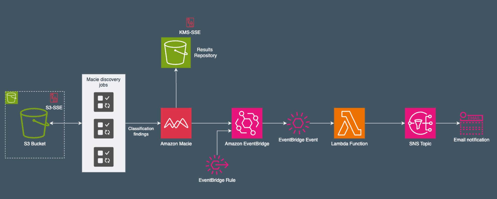

# Enhancing Data Privacy in AWS with Amazon Macie: Hands-On Demonstration <!-- omit in toc -->

In today’s cloud-driven world, data privacy is paramount. Sensitive information—ranging from Personally Identifiable Information (PII) to financial records and intellectual property—demands rigorous protection. AWS Macie, a fully managed data security and data privacy service, offers a robust solution for identifying, classifying, and protecting such data. This hands-on guide demonstrates how to use AWS Macie to secure sensitive data within Amazon S3.

## Table of contents <!-- omit in toc -->

- [Introduction](#introduction)
  - [1. What is AWS Macie?](#1-what-is-aws-macie)
  - [2. Key Features of AWS Macie](#2-key-features-of-aws-macie)
  - [3. Best Practices for Maximizing AWS Macie’s Effectiveness](#3-best-practices-for-maximizing-aws-macies-effectiveness)
- [Implementing AWS Macie](#implementing-aws-macie)
  - [Setup Architecture](#setup-architecture)
  - [Requirements](#requirements)
  - [Usage](#usage)
  - [Step-by-Step Guide](#step-by-step-guide)
- [Conclusion](#conclusion)

## Introduction

### 1. What is AWS Macie?

AWS Macie is a data security service that uses machine learning and pattern matching to automatically detect, classify, and protect sensitive data in S3 buckets. Key benefits include:

- **Sensitive Data Discovery**: Macie identifies and classifies sensitive data, including PII and intellectual property.
- **Risk Assessment**: It evaluates data security and privacy risks, offering actionable insights for mitigation.
- **Compliance Support**: Helps with regulatory compliance, supporting standards like GDPR, HIPAA, and CCPA.

### 2. Key Features of AWS Macie

AWS Macie provides the following core capabilities:

- **Automated Data Classification**: Scans S3 to locate and classify sensitive data.
- **Risk and Compliance Insights**: Offers insights to assess and enhance data security posture.
- **Integration with AWS Security Hub**: Allows for centralized monitoring and incident response.

### 3. Best Practices for Maximizing AWS Macie’s Effectiveness

To make the most of AWS Macie, consider these best practices:

- **Regular Scans**: Configure regular Macie scans to monitor changes in data security continuously.
- **Custom Identifiers**: Leverage custom identifiers to detect organization-specific sensitive data.
- **Centralized Monitoring**: Use Security Hub for a unified security overview, enabling proactive risk management.
- **Proactive Alerts**: Configure EventBridge or CloudWatch alarms for immediate notification on high-risk findings.

## Implementing AWS Macie

We’ll set up AWS Macie and integrate it with other AWS services. This guide walks through configuring Macie, automated with Terraform, and setting up monitoring pipelines, demonstrating Macie’s functionality with a structured example.

### Setup Architecture

The terraform script provisions a couple of cloud ressources while enabling Macie on all buckets in the account.

### Requirements

- Installation of Terraform CLI
- Installation of AWS CLI
- Installation of Git CLI

### Usage

1) Clone repo to your machine.
1) Export ``AWS_ACCESS_KEY`` and ``AWS_SECRET_KEY`` to environment variables.
2) Duplicate the ``variables.tfvars.example`` file, rename it to ``variables.tfvars`` and adjust the values for ``"email"``and ``"owner"``.
3) Run ``terraform init``.
4) Run ``terraform apply`` to provision ressources.
5) Go to AWS Console and explore AWS Macie. All resources deployed via this demo will have the same unique id associated. This ID will be with the outputs of the terraform provisioning.

### Step-by-Step Guide

1) The script will incorporate an **unique_id** to help you identify your freshly created ressources in your AWS account. This ID is with the terraform outputs.
2) You will recieve an email to the chosen address. Click ``confirm`` to be able to recieve notifications from AWS Macie.
3) Begin by exploring the provisioned infrastructure on the AWS Console. Get familiar with the AWS Macie dashboard, where data insights and security findings are displayed. The dashboard provides a high-level overview of active jobs, classification results, and data risk assessments.
4) Configure up a dedicated S3 bucket for storing Macie findings. This bucket is already created by the terraform script. Configure to store to this bucket in the AWS Macie console.
5) There is already a recurring macie job created with the infrastructure. Go ahead and explore the job.
6) Go ahead and create a new macie one time job to learn how to setup such a job.
7) You already provisioned a findings processor pipeline with the terraform script. Go ahaed and explore this pipeline in AWS Evenbridge, AWS Lambda and AWS SNS. Refer to the terraform script to see what you've created.

## Conclusion

AWS Macie offers powerful capabilities to enhance data privacy within your AWS environment. Through this hands-on guide, you can deploy Macie efficiently using Terraform, integrating it with AWS services to automate data classification, processing, and compliance. By following the outlined steps and best practices, organizations can secure their sensitive data and ensure adherence to regulatory standards, safeguarding their cloud environment effectively.

<!-- BEGIN_TF_DOCS -->
## Requirements <!-- omit in toc -->

| Name | Version |
|------|---------|
|  [aws](#requirement\_aws) | ~> 5.0 |

## Providers <!-- omit in toc -->

| Name | Version |
|------|---------|
|  [aws](#provider\_aws) | 5.68.0 |
|  [null](#provider\_null) | 3.2.3 |
|  [random](#provider\_random) | 3.6.3 |

## Resources <!-- omit in toc -->

| Name | Type |
|------|------|
| [aws_cloudwatch_event_rule.macie-findings_rule](https://registry.terraform.io/providers/hashicorp/aws/latest/docs/resources/cloudwatch_event_rule) | resource |
| [aws_cloudwatch_event_target.macie-findings-target](https://registry.terraform.io/providers/hashicorp/aws/latest/docs/resources/cloudwatch_event_target) | resource |
| [aws_iam_role.lambda_role-macie](https://registry.terraform.io/providers/hashicorp/aws/latest/docs/resources/iam_role) | resource |
| [aws_kms_alias.macie_demo-kms-key-alias](https://registry.terraform.io/providers/hashicorp/aws/latest/docs/resources/kms_alias) | resource |
| [aws_kms_key.macie_demo-kms-key](https://registry.terraform.io/providers/hashicorp/aws/latest/docs/resources/kms_key) | resource |
| [aws_kms_key_policy.macie_demo-kms-policy](https://registry.terraform.io/providers/hashicorp/aws/latest/docs/resources/kms_key_policy) | resource |
| [aws_lambda_function.macie_findings_function](https://registry.terraform.io/providers/hashicorp/aws/latest/docs/resources/lambda_function) | resource |
| [aws_lambda_permission.allow_eventbridge](https://registry.terraform.io/providers/hashicorp/aws/latest/docs/resources/lambda_permission) | resource |
| [aws_macie2_account.macie](https://registry.terraform.io/providers/hashicorp/aws/latest/docs/resources/macie2_account) | resource |
| [aws_macie2_classification_job.demo-job](https://registry.terraform.io/providers/hashicorp/aws/latest/docs/resources/macie2_classification_job) | resource |
| [aws_macie2_custom_data_identifier.macie_custom_data_identifier](https://registry.terraform.io/providers/hashicorp/aws/latest/docs/resources/macie2_custom_data_identifier) | resource |
| [aws_s3_bucket.macie_demo-bucket-sensitive](https://registry.terraform.io/providers/hashicorp/aws/latest/docs/resources/s3_bucket) | resource |
| [aws_s3_bucket.macie_demo-results-bucket](https://registry.terraform.io/providers/hashicorp/aws/latest/docs/resources/s3_bucket) | resource |
| [aws_s3_bucket_policy.allow_Macie_access_to_bucket](https://registry.terraform.io/providers/hashicorp/aws/latest/docs/resources/s3_bucket_policy) | resource |
| [aws_s3_bucket_server_side_encryption_configuration.macie_demo-bucket_encryption](https://registry.terraform.io/providers/hashicorp/aws/latest/docs/resources/s3_bucket_server_side_encryption_configuration) | resource |
| [aws_s3_bucket_server_side_encryption_configuration.macie_demo-results-bucket_encryption](https://registry.terraform.io/providers/hashicorp/aws/latest/docs/resources/s3_bucket_server_side_encryption_configuration) | resource |
| [aws_s3_object.provision_sample-data](https://registry.terraform.io/providers/hashicorp/aws/latest/docs/resources/s3_object) | resource |
| [aws_sns_topic.macie_findings_topic](https://registry.terraform.io/providers/hashicorp/aws/latest/docs/resources/sns_topic) | resource |
| [aws_sns_topic_subscription.email_subscription](https://registry.terraform.io/providers/hashicorp/aws/latest/docs/resources/sns_topic_subscription) | resource |
| [null_resource.macie_sample_content](https://registry.terraform.io/providers/hashicorp/null/latest/docs/resources/resource) | resource |
| [random_id.demo_unique-id](https://registry.terraform.io/providers/hashicorp/random/latest/docs/resources/id) | resource |
| [aws_caller_identity.current](https://registry.terraform.io/providers/hashicorp/aws/latest/docs/data-sources/caller_identity) | data source |

## Outputs <!-- omit in toc -->

| Name | Description |
|------|-------------|
|  [resource\_owner](#output\_resource\_owner) | Name of the person who provisioned the resources for reference |
|  [sns\_email](#output\_sns\_email) | Name of the person who provisioned the resources for reference |
|  [unique\_session\_id\_for\_resources](#output\_unique\_session\_id\_for\_resources) | Unique ID of this demonstration for easy allocation |
<!-- END_TF_DOCS -->
